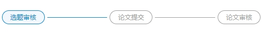

# 步骤条

## 效果图

## 基本使用
```vue
<template>
    <wangxiao-step :count="count" :list="list" />
</template>

<script>
export default {
  name: 'wangxiaoStep',
  data() {
    return {
        count: 2
        list: [
        {
          id: 1,
          prop: 'ssd',
          name: "第一步",
        },
        {
          name: "第二步",
          id: 2,
        },
      ],
    }
  },
  methods: {
    onChenage(index, item) {
      console.log(index, item);
    },
  }
}
</script>
```

## 使用插槽

```vue
<template>
    <Wangxiao-sidebar :sideList="semesterList" label="names" @chenage="onChenage" prop="fieldName">
      <template #first>
        <span>插槽菜单</span>
      </template>
    </Wangxiao-sidebar>
</template>

<script>
export default {
  name: 'WangxiaoSidebar',
  data() {
    return {
      semesterList: [
        {
          names: "第一",
          fieldName: 'first'
        },
        {
          names: "第二",
          fieldName: 'second'
        },
      ]
    }
  },
  methods: {
    onChenage(tab, e) {
      console.log(tab, e);
    },
  }
}
</script>
```

## API

### Attribute

| 属性名 | 描述                           | 类型   | 是否必填 |
| ------ | ------------------------------ | ------ | -------- |
| list   | 侧边栏数据（数组对象：prop: ） | Array  | 是       |
| count  | 当前步骤                       | Number | 否       |

### Event

| 事件名  | 描述           | 回调参数                              |
| ------- | -------------- | ------------------------------------- |
| chenage | 点击某一项触发 | Function(index: number, item: object) |

